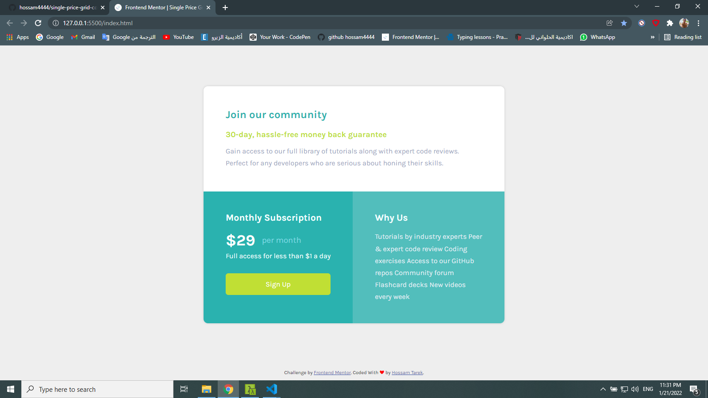

# Frontend Mentor - Single price grid component solution

This is a solution to the [Single price grid component challenge on Frontend Mentor](https://www.frontendmentor.io/challenges/single-price-grid-component-5ce41129d0ff452fec5abbbc). Frontend Mentor challenges help you improve your coding skills by building realistic projects. 

## Table of contents

  - [The challenge](#the-challenge)
  - [Screenshot](#screenshot)
  - [Links](#links)
  - [My process](#my-process)
  - [Built with](#built-with)
  - [Useful resources](#useful-resources)
  - [Author](#author)

### The challenge

Users should be able to:

- View the optimal layout for the component depending on their device's screen size
- See a hover state on desktop for the Sign Up call-to-action

### Screenshot

### Links

- Solution URL: [Frontend Mentor solution URL](https://github.com/hossam4444/single-price-grid-component)
- Live Site URL: [live site URL](https://hossam4444.github.io/single-price-grid-component/)

## My process
Mostly used a Simple Grid Layout

### Built with

- Semantic HTML5 markup
- CSS custom properties
- Only One Time Used Flexbox
- Mostly CSS Grid
- Mobile-first workflow
- 100% Grid Responsive layout
- No Java Script

### Useful resources

- [Elzero Web School](http://elzero.org/) 
the best start to learn web in arabic .

## Author

- Frontend Mentor - [@hossam4444](https://www.frontendmentor.io/profile/hossam4444)
